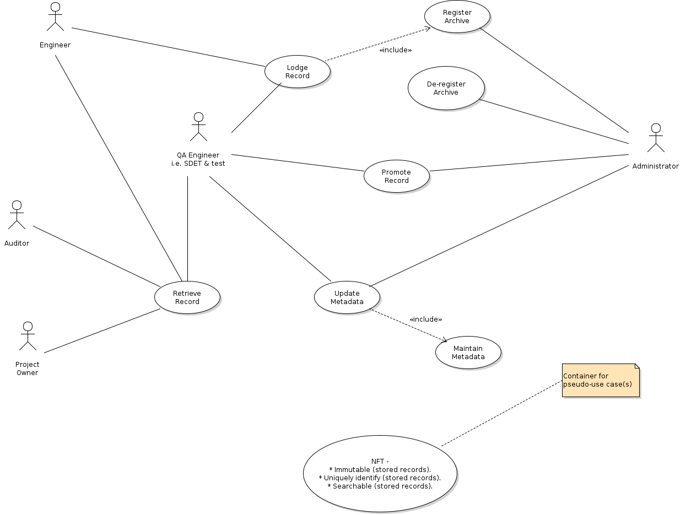

# tease

## Description:

This is TEASE (**T**est-**E**vidence-**A**s-a-**S**ervic**E**) which, as the name might suggest, is (intended to be) a micro-service provisioning a uniform approach to the recording and subsequent retrieval, of configuration management related records and do so in a manner that ensures that the stored data isn't corrupted in/by the storage and once stored, the stored records are immutable where the initial i.e. pilot, case is test evidence based.

---

## Vision

In creating this, my vision was and indeed still is, of a text-based record storrage implementation utilizing the capabilities of Git (& ultimately Github) as the data & meta-data repositories, thereby directly facilitating the KISS principle to be followed.  The basic premise is of records initially being lodged in local repository clone(s) and subsequently promoted to their remote _origin_ repository - typically in the _master_ or _main_ branch, but optionally in named branches where the branch is (expected to be) long-lived.

Founded upon which is the notion of a single unitary container which is run locally to the initiating _user_ and accesses the repositories at one of 3 levels of access whereby the...
- Lowest level i.e. closest to the record source, provisions both storage and retrieval capabilities.
- Higher level is the same container provisioning only a retrieval capability and is typically consumed by e.g. a centralized dashboarding facility.
- Highest level is also the same container, but this time merely serving to provide a central repository for meta-data e.g. 
    - Test pattern (+ any associated sub-pattern) definitions.
    - Archive registry. 

Note that the immutability of the stored records is, as the epithet suggests, inviolable whereas the meta-data used in the storage of the records isn't and may thus be modified ruled by the rigour of appropriate change procedures.

Note also that using this promotion model allows work to be done & recorded locally whilst the remote server is incommunicado (for whatever reason).

---

## Actors

### General (NFT)

This isn't a use case per-se, but merely a container for the NFT use cases that come into play in each and every one of of the following actor specific sub-sections...

As an _interested party_, I want...

- stored records to be immutable in order to be assured of their post-storage quality i.e. untampered state (**Immutable (stored records)**).
- stored records to be uniquely identifiable (**Uniquely Identify (stored records)**).
- searchable stored records (**Searchability (of stored records)**).

### Administrator

#### Use Case(s)

As an _Administrator_, I want to be able to...
- Register an archive repository in order to provide a receiver for records to be lodged (**Register archive**).
- Maintain the meta-data repository in order to maintain the alignment between the definitions & the (current) _thinking_ (**Maintain Metadata**).
- De-register a registered archive (**De-register archive**) in order to keep the registry streamlined (& thus efficient).
- Promote  a record (**Promote Record**), in order to ensure that the centralized records are up-to-date.

### QA Engineer

#### Use Case(s)

As a _QA Engineer_,  I want to be able to...
- Register an archive repository in order to provide a receiver for records to be lodged (**Register new archive**).
- Maintain the meta-data repository in order to maintain the alignment between the definitions & the (current) _thinking_ (**Maintain Metadata**).
- Retrieve a record (**Retrieve record**), using an optional filter, in order to...
    - Verify the correctness of submission(s)) &/or...
    - Generate elements of release notes in terms of e.g. known failed tests & their mitigation(s) (if any).
- Promote  a record (**Promote Record**), in order to ensure that the centralized records are up-to-date.

### Engineer

#### Use Case(s)

As an _Engineer_ (dev, test or even SDET), I want to be able to...
- Lodge a new reord (**Lodge Record**) in order to be able to record the current state.
- Retrieve a record (**Retrieve Record**), using an optional filter, in order to...
    - integrity & correctness of submission(s)) &/or...
    - Generate elements of release notes in terms of e.g. known failed tests & their mitigation(s) (if any).

### Project Owner

#### Use Case(s)

As a  _Project  Owner_, I want to be able to...
- Retrieve a record (**Retrieve Record**), using an optional filter, in order to...
    - Generate elements of release notes in terms of e.g. known failed tests & their mitigation(s) (if any).

### Auditor

#### Use Case(s)

As an _Auditor_, I want to be able to...
- Retrieve a record (**Retrieve Record**), using an optional filter, in order to...
    - Verify the integrity & correctness of submission(s)).

---

## To Do

- ~~Introduce the above use cases in diagrammatic form.~~
- Extrapolate the generics to create a configurable, immutable records archival/storage & retrieval service e.g. **R** **E** of **I**mmutable **E**vidence **S**ervice ;-), of which this i.e. test evidence, is but an instantiation and is such as might be employed in any CM system worthy of the epithet.

---

## References
1. UML Distilled (Third Edition), Fowler, 2004, Addison-Wesley, 0-321-19368-7.
1. Use Case Modelling, Bittner & Spence, 2003, Addison-Wesley, 0-201-70913-9.
1. UML 2.0 In Action, Grassle & Baumann & Baumann, 2005, PACKT, 1-904-81155-8.
1. Building Microservices, Newman, 2016, O'Reilly, 1-491-95035-7.
1. RESTful API Design, Beihl, 2016, API-University Press, 1-514-73516-9.

---

## Author & Copyright

(c) Dave Pointon FIAP MBCS (pointo1d at gmail dot com)

---

## Date

Jul 2021

---

END OF DOCUMENT
